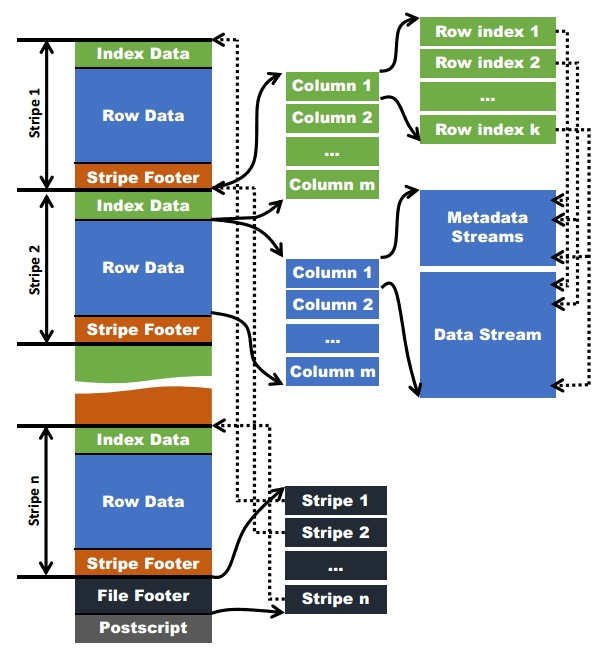

# 利用好谓词下推提升Hive性能

谓词下推（Predicate Pushdown，简称PPD），是指尽量将SQL查询中的谓词（where条件）提前执行，减少后续操作的数量和计算量。在Hive中默认是开启的，也可以通过配置 `SET hive.optimize.ppd=true;` 显式开启。例如，对于如下SQL

```sql
select a.*, b.* 
from a join b on (a.col1 = b.col1)
where a.col1 > 20 and b.col2 > 40
```

如果开启了谓词下推，在join之前会先执行where语句中对两个表的过滤操作，从而减少读取和计算的数据量。否则，会先join再过滤。

除了SQL语句执行层面，在文件存储层面(ORC、Parquet等格式），也会有谓词下推的思想。



以ORC为例，每个ORC文件保存了三个层级的索引：

- file level：包含整个文件每列的统计信息
- stripe level：每个stripe内每列的统计信息
- row level：在同一个stripe内每10000行进行统计，得到每列的统计信息

file 和 stripe 级别的统计信息保存在 file footer 中，可以快速过滤 where条件中不需要读取的文件。row 级别索引包含了每个row group的列统计信息和row group的起始位置。

列统计信息基本都会包含其取值数量、是否包含null，大部分基本类型的列还会包含最小值（min）、最大值（max），数值型的列还有总和（sum）。所有层级的索引都可以用于对需要读取的数据进行过滤。例如，有一个查询语句希望获取年龄大于100岁的记录，where条件中的语句应该为 `age > 100`，那么执行时只会读取包含年龄大于100岁的文件、stripe或row groups。

但要注意有些操作会使文件存储层面的谓词下推失效，在写代码的时候需要注意。例如，有个日志时间字段 `log_time`，其存储的数据格式为 2023-01-01 10:00:00，现在需要取某一天的数据，可能会利用 `to_date` 函数：

```sql
select
    * 
from table_a 
where to_date(log_time) = '2023-01-09';
```

但上面的语句就无法利用ORC文件索引来快速过滤不需要的文件、stripe或row group，因为对字段 `log_time` 调用了函数 `to_date`，导致在真正开始运算前无法知道 `to_date(log_time)` 的实际值。如果修改为使用如下写法，则可以利用文件层面的快速过滤：

```sql
select
    * 
from table_a 
where log_time >= '2023-01-09';
    and log_time < '2023-01-10';
```

另外，上面我们提到文件、strip、row group的统计信息会存储相应数据中是否包含null，因此建议使用null而不是"-"、""等来表示空逻辑。

对以上内容做个小结，利用好谓词下推来提升Hive性能，我们可以：

- 先过滤再join。Hive中默认开启，无需特别关注
- 在where语句中，尽量不要使用函数，例如 `to_date` 等
- 使用null而不是"-"、""等来表示空逻辑


参考资料：

- [Apache ORC文档：Indexes](https://orc.apache.org/docs/indexes.html)
- [Hive Optimization — Quick Refresher](https://medium.com/swlh/hive-optimization-quick-refresher-5e596654bc1d)
- [什么是谓词下推，看这一篇就够了](https://www.cnblogs.com/lubians/p/16590243.html)
- [大数据：Hive-ORC文件存储格式](https://www.cnblogs.com/ittangtang/p/7677912.html)
